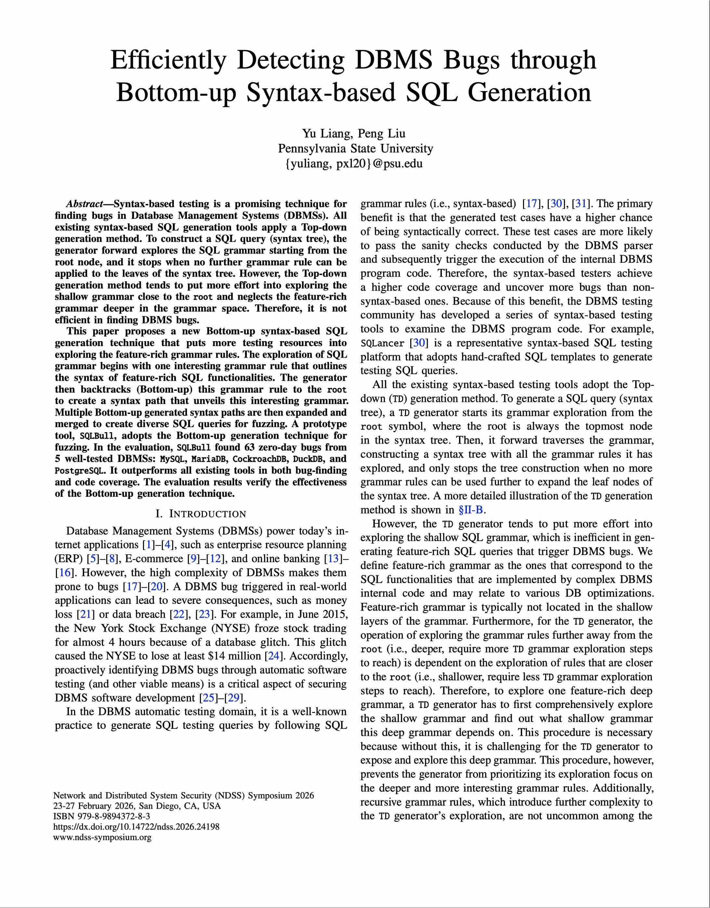

# Efficiently Detecting DBMS Bugs through Bottom-up Syntax-based SQL Generation

<!-- <a href="Paper/paper.pdf"></a> -->

Version: 1.0\
Update: November 16th, 2025\
Paper: Efficiently Detecting DBMS Bugs through Bottom-up Syntax-based SQL Generation

Currently supported DBMS:
1. SQLite3
2. PostgreSQL
3. MySQL
4. MariaDB
5. CockroachDB

<br/><br/>
## Installation & Run

The Installation and Run instructions can be found in this [link](doc/install_n_run_steps.md).

## Publications
<a href="Paper/paper.pdf"></a>

More details can be found in our [NDSS 2026 paper](Paper/paper.pdf).

```
Efficiently Detecting DBMS Bugs through Bottom-up Syntax-based SQL Generation

@inproceedings{liang:sqlbull,
  title        = {{Efficiently Detecting DBMS Bugs through Bottom-up Syntax-based SQL Generation}},
  author       = {Yu Liang and Peng Liu},
  booktitle    = {Network and Distributed System Security (NDSS) Symposium 2026},
  month        = feb,
  year         = 2026,
  address      = {San Diego, CA},
}
```
